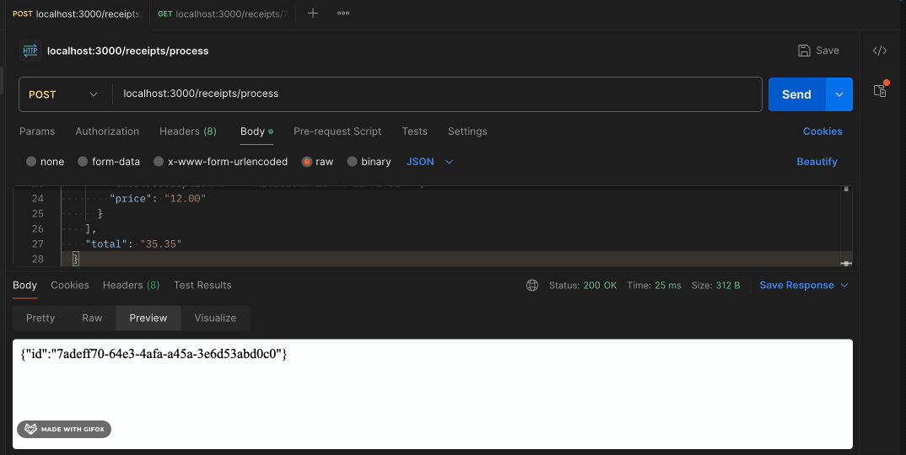

# Receipt Processor Web Service

This is Backend Take Home Assignment for Fetch by Brian Ngo. The service fulfills the described API specification, allowing you to process receipts, calculate points based on certain rules, and retrieve points by receipt ID. The service is built using **Node.js** and can be run locally or within a **Docker container**.

## API Overview



### Endpoints

1. **POST /receipts/process**

   - **Description**: Takes in a JSON receipt and returns a unique ID for the receipt.
   - **Request Payload**:
     ```json
     {
       "retailer": "Target",
       "purchaseDate": "2022-01-01",
       "purchaseTime": "13:01",
       "items": [
         {
           "shortDescription": "Mountain Dew 12PK",
           "price": "6.49"
         },
         {
           "shortDescription": "Emils Cheese Pizza",
           "price": "12.25"
         }
       ],
       "total": "35.35"
     }
     ```
   - **Response**:
     ```json
     {
       "id": "7fb1377b-b223-49d9-a31a-5a02701dd310"
     }
     ```

2. **GET /receipts/:id/points**
   - **Description**: Returns the points awarded for a receipt given its unique ID.
   - **Response**:
     ```json
     {
       "points": 32
     }
     ```

## Points Calculation Rules

Points are awarded based on the following rules:

- 1 point for each alphanumeric character in the retailer name.
- 50 points if the total is a round dollar amount with no cents.
- 25 points if the total is a multiple of 0.25.
- 5 points for every 2 items on the receipt.
- Points for items where the description’s length is a multiple of 3 (calculated using the price \* 0.2, rounded up).
- 6 points if the purchase day is odd.
- 10 points if the purchase time is between 2:00 PM and 4:00 PM.

## Prerequisites

- **Node.js** (for the backend)
- **Docker** (for containerized setup)

## Running the Service

Follow these steps to run the application:

## To Run Locally

### 1. Clone the Repository

```bash
git clone git@github.com:brianhngo/FetchBackend.git
cd FetchBackend
```

### 2. Install Packages

```bash
npm install
```

### 3. Run the command to run locally

```bash
npm start
```

OR

## Docker Setup Instructions

See Dockerfile for further instructions
